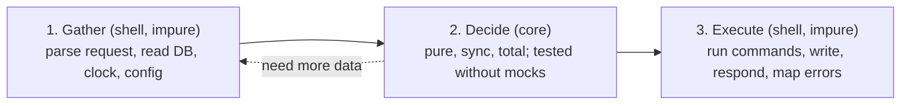

# TypeScript Constitution (Proof by Type)

v2.4, 2026-10-29: body split into this file (the rules) and `references/` (rationale, worked examples, logging detail, tooling detail); no rule changed. v2.3, 2026-10-28: types derive from the code (`as const`, `ReturnType`, `typeof`) over hand-written `type` or `interface` declarations of the same shape (Article III §6). v2.2, 2026-10-26: error events carry the context to rebuild what happened; fields take OpenTelemetry registry names (Article V). v2.1, 2026-10-21: discriminants and log events name a precise state (Article III §3, Article V). v2, 2026-10-19: split into core, baseline and opt-in modules. v1 (2026-10-14) applied everything at once; no repo had adopted it.

## Scope

- **The repo wins.** Its own config and established patterns override this document. The core fills only the gaps a repo leaves open.
- **The baseline and the modules govern** new and personal repos fully, and any repo where they are already adopted.
- **A module is active when the repo's config shows it.** Apply the rules of active modules only. Introduce an inactive module only when the user asks or when scaffolding a new repo.

| Module | Active when the repo has | Adds |
| --- | --- | --- |
| [strict_tsconfig.md](strict_tsconfig.md) | `@tsconfig/strictest` (or its flags) in the tsconfig chain | the `strictest` flags `@tsconfig/bun` leaves off, one per PR |
| [oxlint_type_aware.md](oxlint_type_aware.md) | `typeAware` in the oxlint config | tsgolint, typed rules, staged rollout with bulk suppressions |
| [pure_core.md](pure_core.md) | `src/core/tsconfig.json` | a compiler-enforced pure folder, import and global bans |
| [hatch_ledger.md](hatch_ledger.md) | a CI step counting escape hatches | the escape-hatch count and the `tsc --showConfig` snapshot |
| [property_tests.md](property_tests.md) | `fast-check` in dependencies | property-based tests for core decisions |

Comments follow `code_style.md` in the global wiki.

## Preamble: TypeScript is not Lean, so we shrink and audit its holes

TypeScript's checker is unsound by design. This constitution makes the unsound surface small, explicit and counted, so the rest of the code can be trusted the way a proof is. A type is a claim about data; the only proof of the claim is the single function allowed to build that type. Purity is not checkable by the type system, so rigor comes from small trusted kernels, not clever types. The Lean mapping and the table of where each guarantee is enforced: [references/rationale.md](references/rationale.md).

## Baseline: what the user practises

- **TypeScript 7**: native `tsc` since 7.0 (2026-07-08), no compiler API until 7.1, so tools importing `typescript` break, some silently. TS 7 adopts the 6.0 defaults (`strict` on, `types: []`, `rootDir: ./`, `module: esnext`, `noUncheckedSideEffectImports` on).
- **tsconfig**: extend `@tsconfig/bun` on Bun, `@tsconfig/node-lts` plus `@tsconfig/node-ts` on Node, `@tsconfig/vite-react` on Vite. More strictness comes from the strict tsconfig module.
- **Naming**: `snake_case` wherever a name is chosen: files and directories, values and functions. Types, interfaces and classes stay PascalCase. Object keys alpha-ordered after the discriminant.
- **Prettier**: default config, declared in `package.json` (not `.prettierrc`), with `prettier-plugin-organize-imports`.
- **Tests**: `*.test.ts` next to the source it covers; `bun test` on Bun, vitest on Node and Vite. Assert the whole result (`expect(verdict).toEqual(ok(…))`, `toMatchObject`), never `verdict.ok && verdict.value`: the `&&` hides the discriminant. Fix leftovers in files you touch.
- **Module resolution**: `package.json#imports` and `#exports` over `../../` traversal; add an `imports` key once a path needs `../../../`.

Version-sensitive detail behind these bullets (tool breakage, `*` target expansion, `rootDir`/TS2210): [references/tooling.md](references/tooling.md).

## Article I — Axioms: the checker and the linter

The checker runs at the strictness of the strict tsconfig module once adopted; until then, at `@tsconfig/bun` (or the repo's own) settings. Lint is the second half of the axioms: the oxlint type-aware module. A flag is relaxed only with a written reason in the repo.

## Article II — Architecture: decisions are pure, effects live at the edge

The core receives values and returns decisions as data. The shell gathers inputs, calls the core once, and executes the decision. This is dependency rejection: the core never needs injected dependencies, mocked or otherwise.


```mermaid
flowchart LR
  G["1. Gather (shell, impure)<br/>parse request, read DB, clock, config"] --> D["2. Decide (core)<br/>pure, sync, total; tested without mocks"]
  D --> E["3. Execute (shell, impure)<br/>run commands, write, respond, map errors"]
  D -. "need more data" .-> G
```

### Rules of the core

1. No `async`, no I/O, no `throw` for domain outcomes.
2. No ambient reads: time, randomness, IDs, config, locale and time zone arrive as arguments.
3. Returns data describing what should happen: a discriminated union of outcomes or commands.
4. Imports only other core modules and pure libraries (zod, ts-pattern).
5. No classes: plain data and functions.
6. A test of the core needs no mock. Needing one is a violation signal.

The pure core module makes the compiler enforce rules 1, 2 and 4.

### When the sandwich does not fit

When the decision needs data that depends on an earlier decision, prefer, in order:

1. Gather a superset eagerly, if it is cheap.
2. Stack sandwiches: the core returns `{ kind: "need", query }`, the shell fetches, calls the core again. The loop lives in the shell; every step stays pure.
3. Return a program of commands and interpret it in the shell. Only for real workflows, such as sagas or multi-step jobs.

A transaction that reads with `SELECT ... FOR UPDATE`, decides, then writes is still a sandwich; the whole sandwich runs inside the transaction. Transaction boundaries belong to the shell.

### One decision, many consumers

Reports, statistics, dashboards and access gates call the same core decision function. A second implementation, even a "read-only" one, drifts from the first. When performance demands a second implementation, such as a SQL aggregation, the core function becomes its oracle (property tests module).

Worked sandwich code: [references/examples.md](references/examples.md).

## Article III — Types as propositions: illegal states do not compile

A domain type is a claim; its constructor is the proof. Everything that enters from outside is `unknown` until a parser turns it into a domain type, and nothing downstream checks it again.

### 1. Parse, don't validate

A validator answers yes or no and throws the knowledge away. A parser returns a stronger type that carries the knowledge forward. zod 4 is the parser library, imported as `import * as z from "zod"`. A frontend package that counts bytes may use valibot instead (`zod/mini` measured ~30 KB on a 76 KB bundle, 2026-10-03). Choose one per package, never per file.

Conventions:

- One schema per domain type, next to it and sharing its name: the value is the parser, the type is its output.
- Identifiers normalize inside the schema with `.trim()`, `.toLowerCase()` or `.transform()`, validate with `.pipe()`, then brand (rule 5).
- Boundaries call `safeParse` and turn the outcome into a `Result` (Article IV). Throwing `parse` only at startup, where a crash is the intended outcome.
- `ZodError` never crosses into the core: the boundary maps it to the domain error union.
- `z.any()` is `any`, so it is banned. `.catch()`, and `.default()` on malformed input, are hatches (Article VI).
- When a transform makes input and output differ, `z.input<typeof S>` types the wire format and `z.infer<typeof S>` the domain value.

### 2. Brands give nominal identity: shape or provenance

`UserId` and `OrgId` are both strings, so structural typing lets you swap them. A brand stops that. Two kinds, chosen by what the type claims:

- **Shape brand** (`Email`, `Siren`, `UserId`): the claim is about the bytes, so a parser can prove it. Built with zod `.brand<"X">()`, no hand-written `as`.
- **Provenance brand** (`Principal`, a verified webhook): the claim is about where the value came from, which no parser can check. Built with a module-private `unique symbol` and one ledgered `as` in the module that establishes the provenance (Article V).

A zod brand is forgeable without a cast: any module can declare `z.object({...}).brand<"Principal">()` and its `.parse` output type-checks as the real one. A `unique symbol` brand cannot be built outside its module without an `as`, which review (and the lint, when active) flags. Use a zod brand only for shape claims.

### 3. Unions over flags

```ts
// Bad: 4 representable states, 2 legal
type Payment = { status: "paid" | "pending"; paid_at?: Instant };

// Good: only legal states exist
type Payment =
  | { readonly status: "paid"; readonly paid_at: Instant }
  | { readonly status: "pending" };
```

Count representable states versus legal states. Any gap is a bug waiting for a caller.

Each discriminant value names the state it stands for, and each field names what it holds: `{ kind: "http_error"; http_status: number }`, where `{ kind: "http_status"; status: number }` names a field as a state and leaves `status` ambiguous. A `type` or `status` field beside `kind` gets its qualifier: `record_type`, `http_status`.

No sentinel values inside a branded field. "Unknown" is its own variant, `{ kind: "unknown" }`, never a made-up string such as `ref:<id>` that passes for a real identifier. If a sentinel reached a branded field, either the parser accepted it or someone wrote `as`. Fix it there.

### 4. A decision keeps its reason

If a caller must query the data again to learn why a function returned `null`, the return type is too lossy. Return a union whose variants carry their evidence.

Encode counts in the type only when the decision branches on them: non-empty is `readonly [T, ...T[]]`, at least two is `readonly [T, T, ...T[]]`. These shapes do not survive `.filter` or `.map`, so each use needs a re-check. Elsewhere, a smart constructor enforces the count.

### 5. Identifiers are canonical brands

Any value used as a map key, in an equality check or as an identity (domain, email, SIREN) has exactly one parser, and that parser normalizes it: trim, lowercase where the domain allows, drop a trailing dot from domain names. Equality on an unnormalized string is a hidden bug.

Normalization is domain logic and can be wrong. Domain names need IDNA handling, not just lowercasing; an email's local part is technically case-sensitive. Decide each rule once, in the parser. When the original form matters for display or audit, store `{ canonical, raw }` and compare only on `canonical`.

### 6. Smaller rules

- `readonly` everywhere in the core; `ReadonlyArray`, `ReadonlyMap`.
- String literal unions or `as const` objects instead of enums.
- `satisfies` instead of annotations for config objects, so literal types survive.
- The code carries the type: when `as const`, `ReturnType<typeof f>` or `typeof value` yields the shape, it beats a return annotation and a hand-written `type` or `interface`. `const idle = () => ({ kind: "idle" }) as const; type Idle = ReturnType<typeof idle>;` over `type Idle = { readonly kind: "idle" }` plus `(): Idle =>`. Same reason as `z.infer<typeof S>` (Article III §1). A type the code cannot produce alone (a union across branches such as `JoinDecision`, a port such as `InvoiceStore`) stays declared.
- Prefer one boring correct type over a clever conditional type. A type that needs a comment to be read is too clever.

Parser and ownership examples: [references/examples.md](references/examples.md).

## Article IV — Errors as values; every case is handled

An expected failure is part of the return type. An exception means a bug or an infrastructure fault, never a domain outcome. A `throw` is invisible to the checker: callers cannot see it, and `catch (e)` gives `unknown`.

The error model is plain discriminated unions plus this `Result`; no neverthrow, no Effect.

```ts
type Result<T, E> =
  | { readonly ok: true; readonly value: T }
  | { readonly error: E; readonly ok: false };

const ok = <T>(value: T): Result<T, never> => ({ ok: true, value });
const err = <E>(error: E): Result<never, E> => ({ error, ok: false });
```

In the core, a domain-specific union often beats a generic `Result`: `JoinDecision` already says everything. Use `Result` for parsers and small helpers.

### Exhaustiveness is your totality checker

```ts
const assert_never = (x: never): never => {
  throw new Error(`Unhandled case: ${JSON.stringify(x)}`);
};

switch (decision.kind) {
  case "join": return execute_join(decision);
  case "reject": return reject_response(decision.reason);
  default: return assert_never(decision);
}
```

Add a variant to the union and every unhandled `switch` fails to compile. ts-pattern's `.exhaustive()` gives the same guarantee. A `default` that returns a fallback value destroys it, so a `default` on a union always reaches `assert_never`.

### Errors cross the boundary through one total function

Each runtime owns one mapping from domain errors to its protocol: HTTP status, CLI exit code, UI state, or ack/nack. That mapping is itself an exhaustive switch, so a new error kind cannot reach a user unmapped.

## Article V — One core, a different thin shell per runtime

The core is the same everywhere. Only the shell changes: where input is parsed, which effects run, and how errors are mapped.

| Runtime | Parse at the boundary | Effects the shell runs | Error mapping |
| --- | --- | --- | --- |
| HTTP server | Body, query, params, headers; JSONB and raw SQL rows | DB transaction, outbound calls, response | Domain error to status code and body |
| CLI | argv, env, stdin, file contents | File writes, stdout, network | Domain error to exit code and stderr |
| Frontend (React) | Server responses, URL params, form input, browser storage | Fetch, navigation, storage writes | Domain error to a UI state variant |
| Message worker (RabbitMQ) | Message payload and headers | Ack, nack, publish, DB writes | Domain error to ack, retry, or dead-letter |

Rules for all four:

- Configuration is parsed once at startup into a frozen typed object. Invalid config stops the process before it serves anything.
- Database rows typed by Drizzle are trusted for columns Drizzle owns. JSONB columns and raw SQL results are `unknown` and get parsed.
- On the frontend, a reducer is the functional core: `(state, event) => state` is pure and testable. UI state is a union such as `idle | loading | loaded | failed`, never a set of booleans.
- In a worker, the core decides ack, retry or dead-letter as data. Handlers are idempotent, because redelivery is normal.
- Classes appear in a shell only when a library requires one (`extends Error`, a framework base class).

### Log events name one precise state

A log event is a contract with whoever queries it: dashboards, alerts, the next incident. The rules follow the OpenTelemetry [events](https://opentelemetry.io/docs/specs/semconv/general/events/) and [naming](https://opentelemetry.io/docs/specs/semconv/general/naming/) conventions.

- The name states what happened, as `<namespace>.<entity>.<state>` in lowercase snake_case: `rate_limit.denied`, `dns.lookup.failed`. An operation name such as `dns.check` says what ran and hides the outcome.
- One name, one field set. Outcomes with different fields get different names; per-occurrence values (domain, uid) go in fields, never in the name.
- Field names stay precise across events: a field the OpenTelemetry [attribute registry](https://opentelemetry.io/docs/specs/semconv/registry/attributes/) defines keeps its registry name (`error.type`, `exception.message`, `http.route`); a field of your own is snake_case. `kind` is the in-code discriminant and stays in code: a failure event carries `error.type`, a low-cardinality class from a documented list (`timeout`, `http_error`), and a success event carries none.
- The shell builds each event by an explicit mapping, one `switch` branch per variant: the same total function as error mapping (Article IV). Spreading a domain object (`{ ...failure }`) leaks its internal names into the contract.

### An error event carries what happened

In production the log is the only witness. Each error event answers when, where, who and what on its own, without a second lookup ([OWASP Logging Cheat Sheet](https://cheatsheetseries.owasp.org/cheatsheets/Logging_Cheat_Sheet.html#event-attributes)).

- **One event, one line.** One JSON object per event to stdout, unbuffered: `timestamp` (ISO 8601, UTC), `severity`, `event.name`, then fields. A multi-line `console.error(err)` arrives as separate records in most collectors.
- **Correlation.** An id at the edge (trusted `traceparent` or `x-request-id`, else a fresh UUID) on every event of the request as `request.id`, and on the error page.
- **The whole exception.** `exception.type`, `exception.message`, `exception.stacktrace`, plus `exception.causes`: the `cause` chain as `{ type, message }[]`. `error.type` is the first type in the chain that classifies the failure.
- **The operation.** `http.request.method`, `http.route` (the template, never the raw path), `http.response.status_code`, the failing domain step, and the inputs that chose the branch. Secret values stay out.
- **Severity by impact**: `FATAL` startup failure, `ERROR` unhandled exception, `WARN` handled outbound failure, `DEBUG` client cancellation. A domain rejection is expected: its own event name at `INFO` or `WARN`, no stack. Exception events are named `<operation>.exception`.
- **Excluded data**: session ids (hash if needed), tokens, authorization codes, passwords, keys, sensitive personal data. From a library `cause`, copy only `type` and `message`; redact secret query parameters keeping the key (`code=REDACTED`).
- **Logging never breaks the request.** A logger failure falls back to a plain line on stderr; JSON encoding neutralizes CR and LF.

Long form, with the OTel and OWASP links per rule: [references/logging.md](references/logging.md).

### Authorization is part of the port's type

Store interfaces never accept a `Record<string, unknown>` filter. A scoped read takes its scope as required fields, so an unscoped query does not compile.

A required `owner: string` only proves a value was passed, not that it came from the session. The scope is a `Principal` provenance brand that only the authentication middleware module can build: a plain object literal typed `Principal` fails with TS2741, and forging one elsewhere needs an `as`. Postgres RLS stays underneath as defense in depth: the type protects TypeScript code, not a raw SQL path.

Code: [references/examples.md](references/examples.md).

## Article VI — Escape hatches: every `sorry` is visible and justified

In Lean, `#print axioms` lists every assumption a theorem rests on. TypeScript needs the same discipline by hand. An escape hatch is allowed only where it is visible and justified; the hatch ledger module also counts it.

| Hatch | Rule |
| --- | --- |
| `any` | Banned. Use `unknown` and parse. |
| `!` non-null assertion | Banned. Narrow, or return an error. |
| `as` assertion | Banned except `as const`. A necessary one carries its reason: `// oxlint-disable-next-line typescript/consistent-type-assertions -- <why it holds>` where oxlint is active |
| `@ts-expect-error` | Only with a description; `@ts-ignore` is banned |
| Third-party `.d.ts` | Axiom: wrap the library in an adapter that parses what it returns |
| `JSON.parse`, `res.json()` | Return `any`; type the result as `unknown` immediately |
| `.catch()` on a schema | Hatch: it hides malformed input. A parser over a collection returns `{ rejected, value }` and the caller sets a threshold on `rejected` |
| `.default()` on a schema | Allowed for a field optional by design; a hatch when it replaces malformed input |
| Missing config replaced by an empty default | Banned: a missing config file or required variable is a startup error |
| Generic casts such as `collection<T>()` | Axiom: an `as` with extra steps. Parse what it returns |
| ORM types derived from the schema (Drizzle columns) | Trusted for columns the ORM owns (Article V); JSONB and raw SQL are parsed |
| Typed framework context (Hono `Variables`) | Derive the type from the middleware chain; never declare it by hand |

zod's `.brand()` is itself a type-level cast, accepted once as a library axiom for shape brands. The disable directive is the only comment a hatch gets; its `-- why` is mandatory by review.

Tests may use `as` freely, but fixtures still come from parsers (or fast-check arbitraries), so a test never builds an illegal state.

## Article VII — What types cannot prove, tests check

Types prove shape. Behavior ("never grants a membership on an expired invite") needs a test; a pure core makes it cheap, with nothing to mock. The property tests module turns such claims into fast-check properties.

### Negative type tests prove impossibility

The most Lean-like test in TypeScript asserts that something does not compile:

```ts
// @ts-expect-error: a pending payment has no paid_at
const bad: Payment = { paid_at: now, status: "pending" };
```

If someone loosens the type, the expected error disappears and `tsc` fails, under any runner. vitest packages may add `expectTypeOf` for positive type assertions.

Test pyramid: many unit tests on the core, few integration tests on the shell against a real Postgres and RabbitMQ in containers, almost nothing in between.
